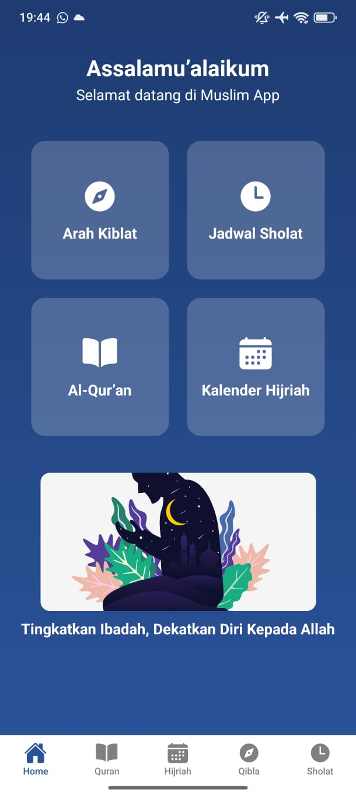
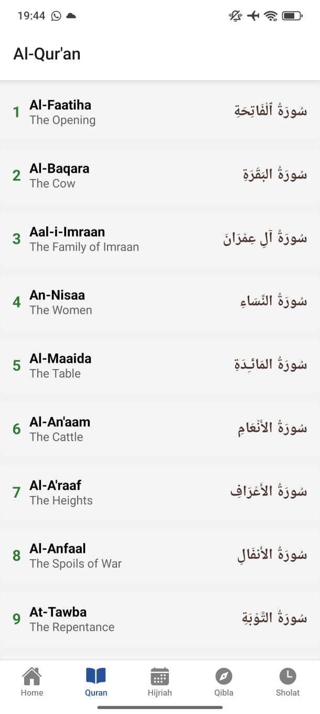
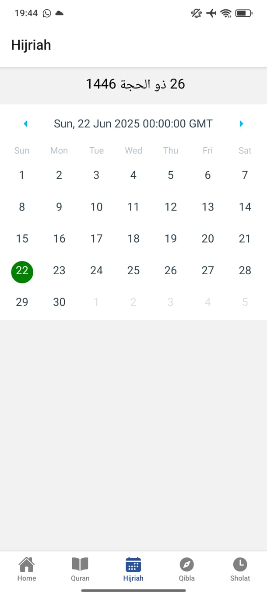
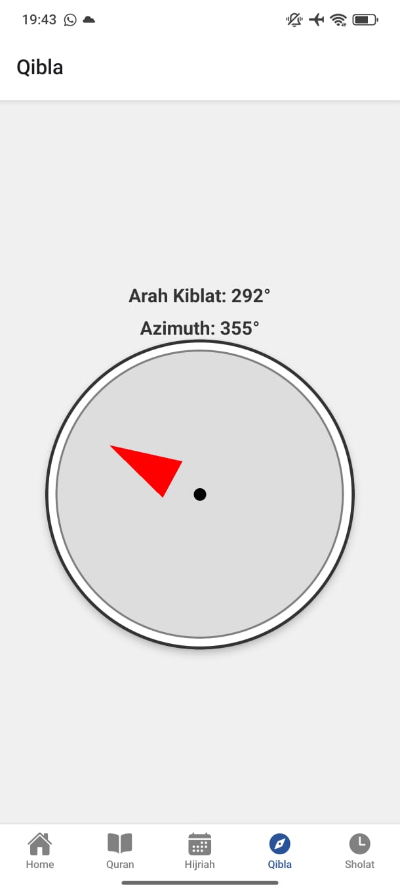
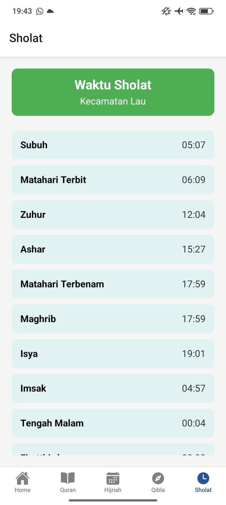

# muslim-app
Merupakan sebuah aplikasi mobile komprehensif yang dirancang untuk memenuhi kebutuhan ibadah harian umat Muslim. Aplikasi ini mengintegrasikan fitur-fitur esensial seperti jadwal sholat akurat, arah kiblat, Al-Qur'an digital, dan kalender Hijriah. Dibangun dengan React Native dan Expo

## How to work?
* pindah ke direktori file 
* npx expo start
* jika gagal gunakan npx expo start --tunnel

# DOKUMENTASI

